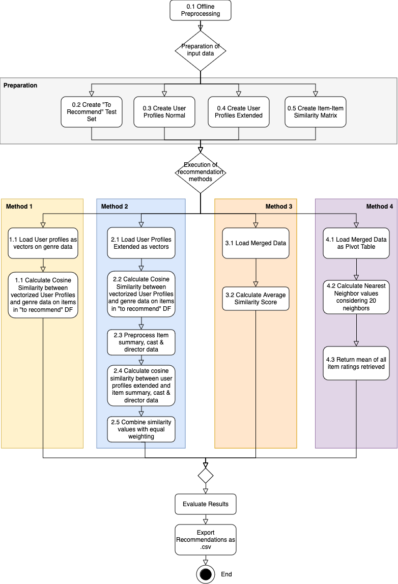

# IRR Assignment02 - Movie Recommender System

|| |
|-----------|--------------|
|**Author:**| Marlon Gelpke|
|**Matriculation Number:**|15-532-849|
|**Date of Submission:**| 08.05.2024|

The submission to this project contains the following files:
```
.
└── IRR_assignment01_Marlon_Gelpke
    ├── code.zip
    ├── method_results/
    │   ├── method_01.csv
    │   ├── method_02.csv
    │   ├── method_03.csv
    │   ├── method_04.csv
    └── IRR_assignment02_approach.pdf
````

## 1. Introduction
This document describes the approach and setup of the Movie Recommender System that was developed in scope of assignment 02 of the University of Zurich Computer Science course "Introduction to Retrieval and Recommendation".

The exact requirements for this task can be accessed for authorized users at the following link: [Exercise 2 Movie Recommender System.pdf](https://lms.uzh.ch/auth/1%3A1%3A1067538524%3A2%3A0%3Aserv%3Ax%3A_csrf%3Af0459af1-67aa-4665-876d-2d149b5cdae1/Exercise%202%20Movie%20Recommender%20System.pdf).

The following materials were supplied to us:
- 5 documents in .csv format providing information about movies, users and users' ratings of movies.
- test.csv: New combination of userID's and movieID's of not yet performed ratings (i.e. movies not seen by a respective user)
- items.csv: Detailed information on movies incl. link to IMDB database and movie summary, cast, etc.

The goal was to follow the instructions and provide a solution in code for the following recommendation methods:

1. Content-based recommender algorithm based on movie genre
2. Content-based recommender algorithm based on more information than just movie genre
3. Item-based collaborative filtering recommender algorithm
4. User-based collaborative filtering recommender algorithm

## 2. Approach
The below describes the technical approach and outlines the design decisions taken to solve this project.

### 2.1 Technical Implementation
The technical execution of this project relies heavily on the following third party libraries:
- scikit-learn - TFIDF vectorization, cosine similarity, score normalization
- pandas - reading of the `.csv` files
- json - writing and reading of the inverse document index
- NLTK - all natural language processing (e.g., tokenization, lemmatization, calculation of similarity, etc.)

The project is spread over nine different Python files. A quick overview and explanation of the different files:
- `method_##_xyz.py` files: Files used to implement the individual solutions fo the methods outlined in chapter 1.
- `method_x_model_based.py`: ML-based algorithm to evaluate the manually implemented methode 01-04.
- `main.py`: Definition of global variables and main file to import all others.
- `helper.py`: Definition of helper functions ranging from loading of pandas data frames over text preprocessing to preparation of user profiles.
- `evaluate.py`: Program to evaluate the calculated movie ratings.
- `offline_preprocessing.py`: Script used to run the preprocessing functions to create the inverse document index to facilitate the simple full-text-search.

### 2.2 Recommendation Methods
Below the overview of a query process can be seen in a flow diagram. The steps in the individual methods are numbered and explained in more detail beneath the flow diagram incl. important technical design decisions.



#### 2.2.0 Preprocessing and preparation
This stage fulfills a crucial role in preprocessing and preparing the available data so it can be used by the individual recommendation methods (1-4) described below.

##### 2.2.0.1 Offline Preprocessing
The largest part of the offline preprocessing is the harmonization of the data files to use common delimeters and to add the respective headers describing the column names as indicated in the README file. In this particular project, the common delimeter ";" was chosen for the output files. This was done as a work around to avoid the fact that some URL's contain commas within them.

##### 2.2.0.2 Creation of "Test Set"
The creation of the test 


##### 2.2.0.3 Creation of user profiles normal

##### 2.2.0.4 Creation of user profiles extended

##### 2.2.0.5 Creation of Item-Item Similarity Matrix**


#### 2.2.1 Method 1: Content-based recommender algorithm based on movie genre

#### 2.2.2 Method 2: Content-based recommender algorithm based on more information than just movie genre

#### 2.2.3 Method 3: Item-based collaborative filtering recommender algorithm

#### 2.2.4 Method 4: User-based collaborative filtering recommender algorithm

## 3. Testing and Interpretation of Recommendation Methods Performance

### 3.1 Calling the Program

### 3.2 Evaluating the algorithm performance

